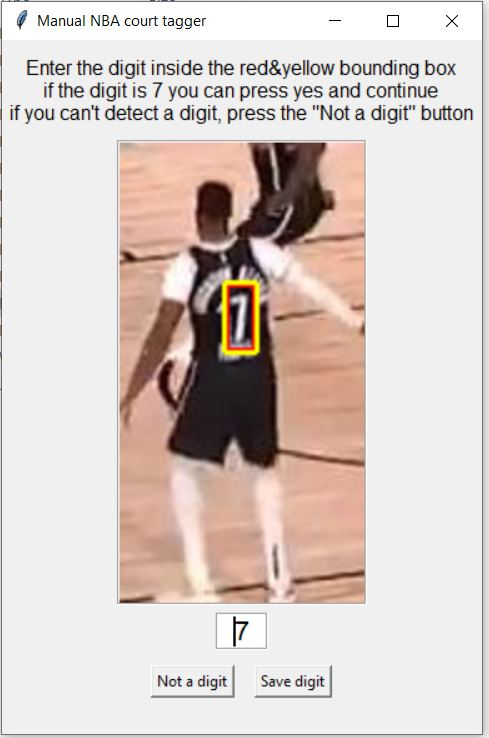
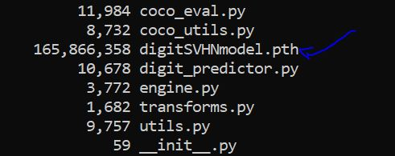
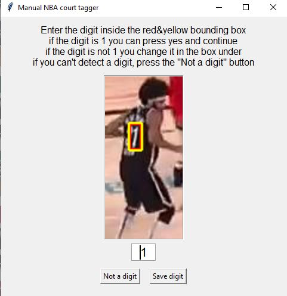
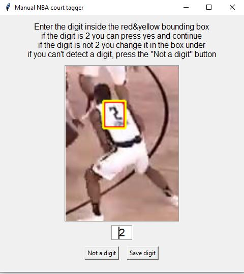

# PlayerJerseyNumberTagger
Semi-supervised GUI to help you tag jersey numbers of players in sports videos for better player tracking and recognition.



For every provided frame of a player, we ask the user whether or not it's an actual player in the game (and not someone in the attendance or the referee).
If it is indeed a player, we try to detect digits within the player's torso area and ask the user to confirm the suggested tag predicated by our DigitPredictor module.
In case the suggested tag is incorrect, the user can type-in the correct digit.

For the digit suggestion we used the [SVHN Dataset](http://ufldl.stanford.edu/housenumbers/) for transfer learning on keypointrcnn_resnet50_fpn architecture.

## Requirements

```bash
pip install -r requirements.txt
```

## YouTube video to players bounding boxes images

To extract the frames of players from a video (either a YouTube video or a local video on your machine) we can use JerseyFramesFromYouTube.py.
In addition to the actual images of players, we save all information regarding the bounding box, torse, digits and more - inside detections.csv
```bash
usage: JerseyFramesFromYouTube.py [-h]
                                  (--YOUTUBE_ID YOUTUBE_ID | --LOCAL_VID LOCAL_VID)
                                  [--output_path OUTPUT_PATH]
                                  [--score_thres SCORE_THRES]
                                  [--frame_interval FRAME_INTERVAL]
                                  [-s START_TIME] [-e END_TIME] [--cpu]
                                  [--resize_video]
```

## Semi-supervised tagger

After we have the folder of frames and detections.csv file from the desired game, we can run our semi-supervised jersey tagger GUI.

Download weights [digitSVHNmodel.pth](https://drive.google.com/file/d/12Qf3uzFMl0h0IQv2okDU6c7Kg-4PI_GC/view?usp=sharing) for the trained digit dectector and place it in digitDetection\ folder.



```bash
python JerseyTaggerGUI.py --csv_path CSV_PATH
```




